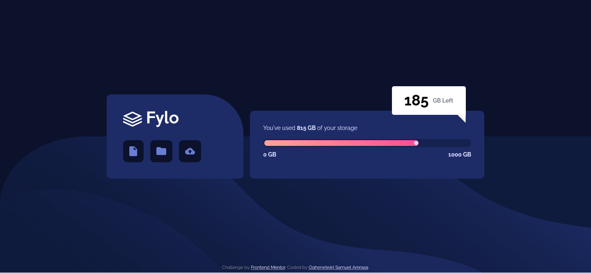
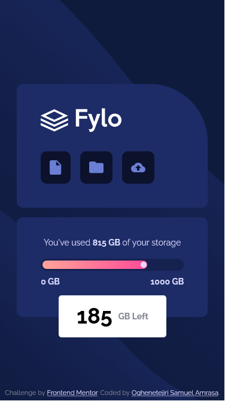

# Frontend Mentor - Fylo data storage component solution

This is a solution to the [Fylo data storage component challenge on Frontend Mentor](https://www.frontendmentor.io/challenges/fylo-data-storage-component-1dZPRbV5n). Frontend Mentor challenges help you improve your coding skills by building realistic projects. 

## Table of contents

- [Overview](#overview)
  - [The challenge](#the-challenge)
  - [Screenshot](#screenshot)
  - [Links](#links)
- [My process](#my-process)
  - [Built with](#built-with)
- [Author](#author)

**Note: Delete this note and update the table of contents based on what sections you keep.**

## Overview

### The challenge

Users should be able to:

- View the optimal layout for the site depending on their device's screen size

### Screenshot

### Links

- Solution URL: [Add solution URL here](https://your-solution-url.com)
- Live Site URL: [Add live site URL here](https://tejiri-data-storage-component.netlify.app)

## My process
## Build Process

### HTML Structure
- The project uses semantic HTML5 elements for better structure and accessibility.
- The main content is wrapped in a `<main>` tag, containing two primary sections:
  1. A header card (`data__storage__hero`) with the logo and navigation icons.
  2. A storage information card (`data__storage__info`) displaying usage details.
- Accessibility features are implemented, including ARIA labels and roles.

### CSS Styling
- CSS variables are defined in the `:root` selector for consistent theming (colors, typography, font sizes).
- A CSS reset is applied to ensure consistent styling across browsers.
- The design uses a mobile-first approach with a responsive layout.
- Flexbox is utilized for layout management, particularly in the icon arrangement and overall component positioning.
- Custom properties are used for easy theme customization and maintenance.

### Typography
- The Raleway font is imported from Google Fonts and applied as the primary typeface.
- Font weights and sizes are defined using CSS variables for consistency and easy updates.

### Components
1. Storage Hero Card:
   - Contains the logo and navigation icons.
   - Icons are styled as buttons for better accessibility and user interaction.

2. Storage Info Card:
   - Displays storage usage information.
   - Includes a custom-styled progress bar to visualize storage usage.
   - Features a message box showing remaining storage.

### Responsive Design
- Mobile layout is the default, with a single-column structure.
- Media query breakpoint at 1024px for larger screens:
  - Layout changes to a two-column design.
  - Background image switches from mobile to desktop version.
  - Message box repositions to the top-right with a custom triangle shape.

### Background
- Different background images for mobile and desktop layouts.
- Background properties are adjusted for proper scaling and positioning.

### Accessibility
- Semantic HTML structure for better screen reader navigation.
- ARIA labels used for interactive elements and informative content.
- Color contrast considerations in the design for readability.

### Performance Considerations
- SVG images used for icons to ensure crisp rendering at all sizes.
- CSS custom properties for efficient styling updates.
- Minimal use of nested selectors to keep specificity low and improve render performance.

### Built with

- Semantic HTML5 markup
- CSS custom properties
- Flexbox
- Mobile-first workflow

## Author

- Frontend Mentor - [@Tejiri-A](https://www.frontendmentor.io/profile/Tejiri-A)

